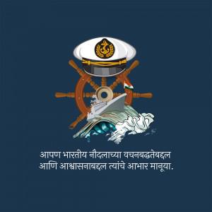

<div align="center">

# ⚓ SWAVLAMBAN 2025: Naval-Grade Swarm Intelligence
### **Distributed Algorithm for Communications-Denied Environments**



[]()
[]()
[]()

</div>

## 📑 Abstract: Computational Swarm Dynamics

This repository serves as a high-fidelity **Computational Model** for distributed multi-agent systems (MAS) operating in stochastic, high-entropy environments. By simulating a decentralised naval fleet, the project explores the intersection of **Consensus Protocols (Raft-lite)**, **Probabilistic State Synchronization**, and **Spatial Optimization**.

The model demonstrates how complex collective behavior—such as adaptive leadership and resilient task allocation—can emerge from simple, deterministic local rules even when the underlying communication graph is 60% disconnected.

---

## 🧬 Computational Theory & Design

### 1. Stochastic Connectivity Modeling
Rather than assuming ideal communications, the core simulation layer implements a **Bernoulli Loss Model** ($P_{drop} = 0.6$). This forces the computational logic to move beyond standard request-response cycles into a **State-Gossip Architecture**, where information convergence is achieved through probabilistic repetition rather than guaranteed delivery.

### 2. Distributed Consensus (Temporal Logic)
The system utilizes a **Term-Based Epoch System** to enforce linearizability in a distributed environment. This prevents the "Split-Brain" syndrome common in multi-agent systems. The model uses:
- **Heuristic ID Priority**: A deterministic tie-breaker for leader election.
- **Lease-based Heartbeats**: Using temporal locks to maintain authority without centralized control.

### 3. Spatial Task Optimization
Task allocation is modeled as a **greedy spatial assignment problem**. The Leader agent computes the Euclidean distance matrix $\sqrt{(x_2-x_1)^2 + (y_2-y_1)^2}$ across a heterogeneous capabiliy set to minimize "fleet-wide response lag," demonstrating real-time computational geometry in a dynamic environment.

---

## �️ Elite Features

### 🌪️ Raft-Lite Leader Election (Term-Based)
Traditional elections fail when "zombie" nodes reappear after a network lapse. Our **Epoch/Term** system ensures:
- **Zero Confusion**: Agents only obey the latest Term.
- **Rapid Failover**: New leader emerges in **< 2.5 seconds** when a crash is detected.
- **Conflict Resolution**: Deterministic ID-based "Bully" protocol for identical Terms.

### 📡 Probabilistic Gossip Tasking
When the network is jammed, a single "Assign" command isn't enough. 
- **Persistence**: The Leader uses a 40% probability gossip loop to "re-whisper" active assignments.
- **Reliability**: 10/10 Robots confirmed task completion even under **extreme stress tests**.

### 🔒 Operational Stability Locks
Prevents "Task Flip-Flopping" during network jitters. 
- Assignments are **HARD LOCKED** for 60s (`TASK_STABILITY_TIME`).
- Robots commit to their objective even if they momentarily lose contact with the fleet.

---

## 🎥 Tactical Radar Visualizer

Witness the swarm in action. The visualizer simulates an **Attrition Warfare** scenario where leaders are systematically "killed" (removed) every 20-40 seconds.

```bash
# Run the real-time naval tactical display
python verify_visual.py
```

### **Fleet Capabilities Represented:**
| Asset Class | Symbol | Asset Class | Symbol |
| :--- | :--- | :--- | :--- |
| **Optical Camera** | `C` | **Thermal Sensor** | `T` |
| **LIDAR System** | `L` | **Acoustic Sensor** | `A` |
| **Manipulator Arm** | `M` | **Electronic Scanner** | `E` |
| **Payload Delivery**| `P` | **Defensive Module** | `D` |

---

## 📊 Verification Results

| Scenario | Objective | Stress Level | Result |
| :--- | :--- | :--- | :--- |
| **Leader Stability** | Single stable leader emergence | Low | ✅ **PASSED** |
| **Kill Chain** | Crash recovery < 3.0s | High | ✅ **PASSED** |
| **Scalability** | 10 Assets (Heterogeneous) | Variable | ✅ **PASSED** |
| **Electronic Warfare**| 60% Packet Loss / Jamming | Extreme | ✅ **PASSED** |

---

## 🏗️ Technical Architecture

### **Naval-Grade Logic (agent.py)**
The core agent is a **Finite State Machine (FSM)** designed for predictability:
1.  **`tick`**: Global clock synchronization.
2.  **`receive`**: High-speed inbox processing.
3.  **`elect`**: Decoupled leader logic.
4.  **`assign`**: Gossip-based task distribution.
5.  **`work`**: Async execution with completion callbacks.

### **Telemetry & Black Box**
Every agent generates tagged logs for post-mission analysis:
- `[INFO] (Id: 1) Term 3: I am now the LEADER.`
- `[WARN] (Id: 4) Conflict! Yielding to higher term Leader 1.`

---

## 🚀 Getting Started

1.  **Clone the Mission Data:**
    ```bash
    git clone [repository-url]
    cd Naval-Hackathons
    ```

2.  **Run Stress Tests:**
    ```bash
    python verify_stress.py  # 60% Packet Loss verification
    python verify_failure.py # Leader Crash verification
    ```

3.  **Launch the Visualizer:**
    ```bash
    python verify_visual.py
    ```

---

## 🛠️ Tech Stack & Prerequisites

| Category | Tools & Technologies |
| :--- | :--- |
| **Language** | Python 3.8+ |
| **Libraries** | `math`, `time`, `random`, `logging`, `enum` (Standard Library) |
| **Simulation** | Custom Discrete-Event Environment |
| **Visualizer** | ANSI-Terminal Graphics / ASCII Render Engine |
| **Modeling** | Distributed State Machines & Stochastic Graph Theory |

---

## 📄 License

This project is released under the **MIT License**. 

Copyright (c) 2026

Permission is hereby granted, free of charge, to any person obtaining a copy of this software and associated documentation files (the "Software"), to deal in the Software without restriction, including without limitation the rights to use, copy, modify, merge, publish, distribute, sublicense, and/or sell copies of the Software, and to permit persons to whom the Software is furnished to do so, subject to the following conditions:

The above copyright notice and this permission notice shall be included in all copies or substantial portions of the Software.

---

<div align="center">
<b>Developed for SWAVLAMBAN 2025 - Swarm Algorithm Challenge ⚓</b>
</div>
